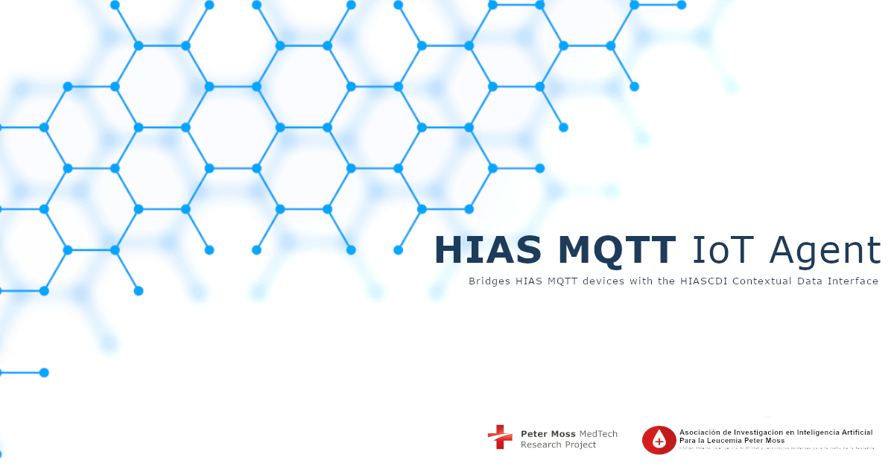

# Agent Documentation

    

# Introduction

A **HIAS IoT Agent** is a bridge between HIAS network devices and applications, and the HIASCDI Contextual Data Interface. The **HIAS MQTT IoT Agent** communicates with HIAS devices and applications using the MQTT machine to machine communication protocol.

&nbsp;

# MQTT

The Message Queuing Telemetry Transport (MQTT) is a lightweight machine to machine communication protocol designed to provide communication between low resource devices.

The protocol is publish-subscribe (Pub/Sub) communication protocol that runs over the Internet Protocol Suite (TCP/IP).

&nbsp;

# HIAS

[HIAS - Hospital Intelligent Automation Server](https://github.com/leukaemiamedtech/HIAS-Core) is an open-source server for hospitals and medical centers, designed to control and manage a network of intelligent IoT connected devices and applications.

## HIAS IoT Agents

The HIAS iotJumpWay IoT Agents are based on FIWARE IoT Agents and are a selection of protocol/transfer specific applications that act as a bridge between the **HIASCDI Contextual Data Interface** & the **HIASHDI Historical Data Interface** and the devices and applications connected to the HIAS network via the iotJumpWay. Supported protocols currently include **HTTP**, **MQTT**, **Websockets**, **AMQP** and **Bluetooth/Bluetooth Low Energy (BLE)**.

Each IoT Agent provides a North & South Port interface that allows communication to and from the Context Broker.

__Source: [FIWARE IoT Agents](https://fiware-tutorials.readthedocs.io/en/latest/iot-agent/index.html)__

The North Port interface of an IoT Agent listens to southbound traffic coming from the Context Broker towards the devices and applications.

__Source: [FIWARE IoT Agents](https://fiware-tutorials.readthedocs.io/en/latest/iot-agent/index.html)__

The IoT Agent sends southbound traffic to devices and applications using a protocol that is supported by the device/application, and receives northbound traffic from the devices/applications which it then forwards to the Context Broker.

&nbsp;

# GETTING STARTED

To get started, follow the following guides:

- [Ubuntu installation guide](installation/ubuntu.md)
- [Ubuntu usage guide](usage/ubuntu.md)

&nbsp;

# Contributing
Peter Moss Leukaemia MedTech Research CIC encourages and welcomes code contributions, bug fixes and enhancements from the Github community.

Please read the [IOT AGENT CONTRIBUTING](https://github.com/leukaemiamedtech/contributing-guides/blob/main/CONTRIBUTING-GUIDE-IOT-AGENTS.md "IOT AGENT CONTRIBUTING") guide for a full guide to contributing to our IoT Agent projects. You will also find our code of conduct in the [CODE OF CONDUCT](https://github.com/leukaemiamedtech/contributing-guides/blob/main/CODE-OF-CONDUCT.md) document.

## Contributors
- [Adam Milton-Barker](https://www.leukaemiamedtechresearch.org.uk/about/volunteers/adam-milton-barker "Adam Milton-Barker") - [Peter Moss Leukaemia MedTech Research CIC](https://www.leukaemiamedtechresearch.org.uk "Peter Moss Leukaemia MedTech Research CIC") Founder & Managing Director.

&nbsp;

# Versioning
We use [SemVer](https://semver.org/) for versioning.

&nbsp;

# License
This project is licensed under the **MIT License** - see the [LICENSE](LICENSE "LICENSE") file for details.

&nbsp;

# Bugs/Issues
We use the [repo issues](https://github.com/leukaemiamedtech/hias-mqtt-iot-agent/issues/new/choose "repo issues") to track bugs and general requests related to using this project. See [IOT AGENT CONTRIBUTING](https://github.com/leukaemiamedtech/contributing-guides/blob/main/CONTRIBUTING-GUIDE-IOT-AGENTS.md "IOT AGENT CONTRIBUTING") guide for more info on how to submit bugs, feature requests and proposals.